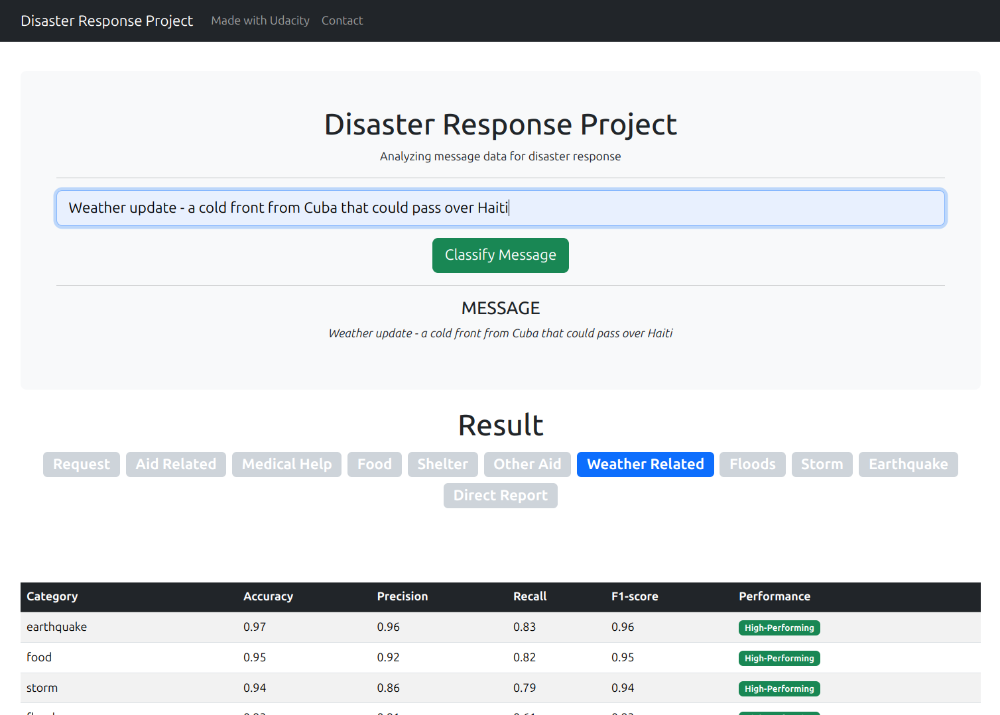

# Disaster Response Pipeline Project

Data-Driven Disaster Response: Smart Message Classification System.

## Introduction

As a Udemy [Data Scientist](https://www.udacity.com/enrollment/nd025) Nanodegree Program student, I'm tasked with solving the **Disaster Response Pipeline Project** and publishing the results.

_This project aims to revolutionize disaster response by developing an intelligent system that rapidly categorizes and routes incoming messages to appropriate relief agencies. Using advanced NLP and machine learning, it provides instant multi-category classification through a user-friendly web interface, enabling swift and efficient resource allocation. The goal is to significantly improve disaster management effectiveness, ultimately saving more lives and minimizing crisis impact through data-driven response strategies._


This project applies data engineering skills to analyze disaster data from Appen and build a model for an API that classifies disaster messages. The main components include:

- **ETL Pipeline**: Processes and cleans disaster message data, storing it in a SQLite database. (data/process_data.py)
- **ML Pipeline**: Develops a machine learning model to categorize disaster messages (models/train_classifier.py).
- **Flask Web App**: Provides an interface for emergency workers to input new messages and receive classification results (app/run.py).

Key features:

- Real-time classification of disaster messages
- Data visualizations of the disaster response data
- Utilizes NLP and machine learning techniques

The project showcases:

- Data pipeline development
- Machine learning model creation
- Web application deployment
- Clean, organized code structure

The notebook and source code are available here:

- Blog post: <https://blog.anibalhsanchez.com/en/blogging/87-data-driven-disaster-response-smart-message-classification-system.html>
- Repository: <https://github.com/anibalsanchez/disaster-response-pipeline-project>

## Quick Start Guide - Setup and Execution

**Prepare the Environment**

- Clone the repository

**Set up Database and Model**

Run these commands in the project's root directory:

- ETL Pipeline (data cleaning and database storage):
  ```sh
  python data/process_data.py data/disaster_messages.csv data/disaster_categories.csv data/DisasterResponse.db > process_data.log
  ```
- ML Pipeline (model training and saving):
  ```sh
  python models/train_classifier.py data/DisasterResponse.db models/classifier.pkl > train_classifier.log
  ```

**Launch the Web Application**

- Navigate to the app directory: `cd app`
- Start the Flask server: `python run.py`

**Access the Web Interface**

- Open your browser and go to: `http://localhost:3001`

Ensure all file paths are correct before running scripts. The web app may take a moment to load due to data processing.



### Lando Container Development

For convenience, the project contains the Lando development container definition in the `.lando.yml` file. To start the environment, execute:

```sh
lando start

 ✔ Container disasterresponsepipelineproject_python_1  Started                                                                 0.1s
 * Serving Flask app 'run'
 * Debug mode: on
WARNING: This is a development server. Do not use it in a production deployment. Use a production WSGI server instead.
 * Running on all addresses (0.0.0.0)
 * Running on http://127.0.0.1:3001
 * Running on http://192.168.96.2:3001
Press CTRL+C to quit
 * Restarting with stat
 * Debugger is active!
 * Debugger PIN: 139-837-717
192.168.96.1 - - [29/Oct/2024 11:05:28] "GET / HTTP/1.1" 200 -
```

### Production Cloud Environments

The project also includes the basic configuration for Apache Python WSGI, `disaster-response-pipeline-project.wsgi`, and the Amazon AWS AppRunner, `apprunner.yaml`. The Amazon AWS AppRunner was an attempt to run the project in this context, but it fell short due to the limited resources. The project's proper cloud configuration is a classic setup in **Amazon EC2, a c5.xlarge instance**.

## Exploring the Data

To start the project, I imported the disaster messages and categories and proceeded with the ETL and cleanup.

The ETL (Extract, Transform, Load) process described in the code can be explained in simpler terms as follows:

### Data Loading

The process begins by reading two separate CSV files: one containing messages and another with categories. These two datasets are merged based on a common identifier, creating a comprehensive dataset.

### Data Cleaning

The cleaning process starts by removing duplicate messages and filtering out entries that begin with 'NOTES:' (these messages are manually identified as unrelated to disasters). The text of each message is then preprocessed by removing URLs (replacing them with a "urlplaceholder" label) and special characters and converting everything to lowercase for consistency.

### Data Restructuring

Since the classification is based on the English language, the 'original' message column is eliminated.

#### Category Handling

The 'categories' column initially contains multiple categories in a single string and is split into separate columns. Each category is converted from a text label to a binary value, making it easier to work with in data analysis or machine learning tasks. The newly created category columns are added to the primary dataset.

As mentioned in the project definition, the dataset is imbalanced. There are categories with few samples—for instance, the `water` column. The small number of samples of these categories affects the model training. To test different scenarios, I defined a threshold (based on the `water` column) of 0.07 to remove the columns in which the ratio is lower and developed the routine `clean_data_full`. This process keeps only the most relevant columns and removes any rows where all category values are zero, ensuring that each remaining entry has at least some categorization.

Given the exercise scope, the project trains the final model with all 36 categories using the `clean_data_base` method.

### Final Cleanup

This ETL process essentially transforms the data from two sources into a clean, structured format ready for further analysis or modeling.

## Feature set exploration

This is the list of categories filtered above the 0.07 threshold:

| Name |
|------|
| request |
| aid_related |
| medical_help |
| child_alone |
| food |
| shelter |
| other_aid |
| weather_related |
| floods |
| storm |
| earthquake |
| direct_report |

The whole list of the 36 categories are:

| Name |
|------|
| related |
| request |
| offer |
| aid_related |
| medical_help |
| medical_products |
| search_and_rescue |
| security |
| military |
| child_alone |
| water |
| food |
| shelter |
| clothing |
| money |
| missing_people |
| refugees |
| death |
| other_aid |
| infrastructure_related |
| transport |
| buildings |
| electricity |
| tools |
| hospitals |
| shops |
| aid_centers |
| other_infrastructure |
| weather_related |
| floods |
| storm |
| fire |
| earthquake |
| cold |
| other_weather |
| direct_report |

## Disaster Response Classifier

The Disaster Response Classifier implements a machine-learning process for classifying disaster-related messages.

The text processing processes the text by breaking it into individual words and simplifying them to their base form, **lemmatization** via WordNet Lemmatizer.

The model is built using the **TF-IDF vectorization** and the **Random Forest** method to learn how to simultaneously categorize messages into multiple disaster-related categories (via the Multi-Output Classifier). To compensate the possible imbalance in the dataset, the **balanced class weight** and the **balanced_subsample class weight** have been tested in the optimization search. The parameter can help improve the model's performance on the minority classes without the need for additional data preprocessing or sampling techniques. The **Grid Search** technique optimizes the model and finds the best parameters.

Finally, the data is split into training and testing sets for evaluation. The confusion matrix and the f1 scores are produced to analyze the results.

The optimized model is saved for later use in the web app.

## Findings in the Disaster Response Dataset

I trained the model in the fully cleaned categories and the full list of categories. The model performs well across most categories, with accuracies ranging from 0.72 to 1.00. This indicates that the classifier is effective in categorizing disaster-related messages.

The following sorted tables allow easier identification of the best and worst performing categories based on their F1-scores.

- High-Performing: F1-score ≥ 0.90
- Moderate-Performing: 0.80 ≤ F1-score < 0.90
- Lower-Performing: F1-score < 0.80

### Confusion Matrix Table For Fully Cleaned Categories

| Category | Accuracy | Precision | Recall | F1-score | Performance |
|----------|----------|-----------|--------|----------|-------------|
| earthquake | 0.97 | 0.96 | 0.83 | 0.96 | High-Performing |
| food | 0.95 | 0.92 | 0.82 | 0.95 | High-Performing |
| storm | 0.94 | 0.86 | 0.79 | 0.94 | High-Performing |
| floods | 0.93 | 0.91 | 0.61 | 0.93 | High-Performing |
| shelter | 0.93 | 0.84 | 0.66 | 0.92 | High-Performing |
| medical_help | 0.89 | 0.68 | 0.53 | 0.89 | Moderate-Performing |
| weather_related | 0.89 | 0.93 | 0.85 | 0.89 | Moderate-Performing |
| request | 0.86 | 0.79 | 0.74 | 0.86 | Moderate-Performing |
| aid_related | 0.85 | 0.89 | 0.91 | 0.85 | Moderate-Performing |
| direct_report | 0.81 | 0.70 | 0.72 | 0.81 | Moderate-Performing |
| other_aid | 0.78 | 0.56 | 0.31 | 0.75 | Lower-Performing |

These are **High-Performing Categories**:

- **Earthquake, Food, Storm, Floods, and Shelter**: These categories show excellent performance with F1-scores above 0.90, indicating high accuracy in identifying these specific disaster-related messages.

These are the **Moderate-Performing Categories**:

- **Medical Help, Weather Related, Request, Aid Related, and Direct Report**: These categories show good performance with F1-scores around 0.85 (+-0.05), suggesting reliable classification for these broader categories.
- Concerning to **Medical Help**: Despite the accuracy (0.89), it has a low recall (0.53) for positive cases, suggesting _the model might be missing many true medical help requests_.

These are the **Lower-Performing Categories**:

- **Other Aid**: This category has the lowest F1-score (0.75), indicating difficulty in accurately classifying messages related to miscellaneous aid requests.

**Imbalanced Data Considerations**: Several categories (e.g., Medical Help, Floods) show high accuracy but lower recall for the positive class, indicating a potential class imbalance. This suggests the model might be biased towards the majority class in these categories.

### Confusion Matrix Table For All 36 Categories

| Category | Accuracy | Precision | Recall | F1-score | Performance |
|----------|----------|-----------|--------|----------|-------------|
| child_alone | 1.00 | 0.00 | 0.00 | 1.00 | High-Performing |
| related | 0.99 | 1.00 | 1.00 | 0.99 | High-Performing |
| offer | 0.99 | 0.00 | 0.00 | 0.99 | High-Performing |
| tools | 0.99 | 0.00 | 0.00 | 0.99 | High-Performing |
| shops | 0.99 | 0.00 | 0.00 | 0.99 | High-Performing |
| missing_people | 0.99 | 0.78 | 0.22 | 0.98 | High-Performing |
| fire | 0.99 | 0.57 | 0.15 | 0.98 | High-Performing |
| clothing | 0.98 | 0.58 | 0.53 | 0.98 | High-Performing |
| electricity | 0.98 | 0.59 | 0.50 | 0.98 | High-Performing |
| hospitals | 0.98 | 0.30 | 0.18 | 0.98 | High-Performing |
| cold | 0.98 | 0.68 | 0.54 | 0.98 | High-Performing |
| money | 0.97 | 0.51 | 0.41 | 0.97 | High-Performing |
| security | 0.97 | 0.27 | 0.15 | 0.97 | High-Performing |
| aid_centers | 0.98 | 0.40 | 0.06 | 0.97 | High-Performing |
| military | 0.96 | 0.55 | 0.63 | 0.97 | High-Performing |
| search_and_rescue | 0.96 | 0.53 | 0.26 | 0.96 | High-Performing |
| water | 0.96 | 0.72 | 0.82 | 0.96 | High-Performing |
| death | 0.96 | 0.67 | 0.56 | 0.96 | High-Performing |
| earthquake | 0.96 | 0.88 | 0.82 | 0.96 | High-Performing |
| refugees | 0.95 | 0.41 | 0.43 | 0.95 | High-Performing |
| transport | 0.95 | 0.51 | 0.39 | 0.95 | High-Performing |
| food | 0.94 | 0.80 | 0.82 | 0.94 | High-Performing |
| buildings | 0.94 | 0.56 | 0.67 | 0.94 | High-Performing |
| storm | 0.93 | 0.70 | 0.77 | 0.94 | High-Performing |
| medical_products | 0.93 | 0.43 | 0.50 | 0.93 | High-Performing |
| floods | 0.93 | 0.66 | 0.72 | 0.93 | High-Performing |
| shelter | 0.92 | 0.68 | 0.71 | 0.92 | High-Performing |
| other_weather | 0.92 | 0.38 | 0.41 | 0.92 | High-Performing |
| medical_help | 0.90 | 0.50 | 0.56 | 0.91 | High-Performing |
| other_infrastructure | 0.91 | 0.27 | 0.31 | 0.92 | High-Performing |
| request | 0.87 | 0.71 | 0.72 | 0.87 | Moderate-Performing |
| weather_related | 0.86 | 0.85 | 0.76 | 0.86 | Moderate-Performing |
| infrastructure_related | 0.88 | 0.33 | 0.36 | 0.88 | Moderate-Performing |
| other_aid | 0.80 | 0.42 | 0.44 | 0.80 | Moderate-Performing |
| direct_report | 0.81 | 0.64 | 0.67 | 0.81 | Moderate-Performing |
| aid_related | 0.72 | 0.80 | 0.66 | 0.72 | Lower-Performing |

The model shows varying performance across the 36 different categories. High accuracy scores are across most categories (>0.90 in many cases). The precision, recall, and F1-scores vary significantly between categories.

The **best-performing categories** are Related (Accuracy: 0.99, Precision: 1.00, Recall: 1.00, F1: 0.99), Food (Accuracy: 0.94, Precision: 0.80, Recall: 0.82, F1: 0.94) and Earthquake Good performance (Accuracy: 0.96, Precision: 0.88, Recall: 0.82, F1: 0.96).

The **worst-performing** are Offer (Precision: 0.00, Recall: 0.00), Child_alone (Precision: 0.00, Recall: 0.00), Poor performance (Precision: 0.00, Recall: 0.00) and Shops (Precision: 0.00, Recall: 0.00).

**Imbalanced Data Considerations**: There are categories with **a high accuracy but low precision/recall**.
Categories like "fire, "security", "missing_people", and "hospitals" show this pattern and suggest potential class imbalance issues.

There are categories with **zero precision and recall**. Categories like "offer", "child_alone", "tools", and "shops". It indicates severe class imbalance or a complete lack of positive examples.

Other categories like "aid_related" and "weather_related" show balanced metrics, suggesting a more balanced data distribution.

To address class imbalance, techniques like oversampling, undersampling, or SMOTE for imbalanced categories are recommended to improve poorly performing categories. Additionally, the categories with zero precision/recall require to gather more data to overcome this issue.

By addressing these issues, the model's performance can be improved across all categories, especially those currently underperforming.

## Conclusion

The classifier performs well overall, especially in specific disaster types like earthquakes and storms. Data cleaning significantly affects the model's results. There's room for improvement in the poorly performing categories. Further analysis and potential model adjustments could enhance performance in these areas.

## LICENSE

Attribution 4.0 International - CC BY 4.0 <https://creativecommons.org/licenses/by/4.0/>

<p xmlns:cc="http://creativecommons.org/ns#" xmlns:dct="http://purl.org/dc/terms/"><a property="dct:title" rel="cc:attributionURL" href="https://github.com/anibalsanchez/answering-house-prices-questions-based-on-advanced-regression-techniques">Disaster Response Pipeline Project</a> by <a rel="cc:attributionURL dct:creator" property="cc:attributionName" href="https://www.linkedin.com/in/anibalsanchez/">Anibal H. Sanchez Perez</a> is licensed under <a href="https://creativecommons.org/licenses/by/4.0/?ref=chooser-v1" target="_blank" rel="license noopener noreferrer" style="display:inline-block;">Creative Commons Attribution 4.0 International</a></p>

Photo by <a href="https://unsplash.com/@kellysikkema?utm_content=creditCopyText&utm_medium=referral&utm_source=unsplash">Kelly Sikkema</a> on <a href="https://unsplash.com/photos/traffic-light-sign-underwater-_whs7FPfkwQ?utm_content=creditCopyText&utm_medium=referral&utm_source=unsplash">Unsplash</a>
